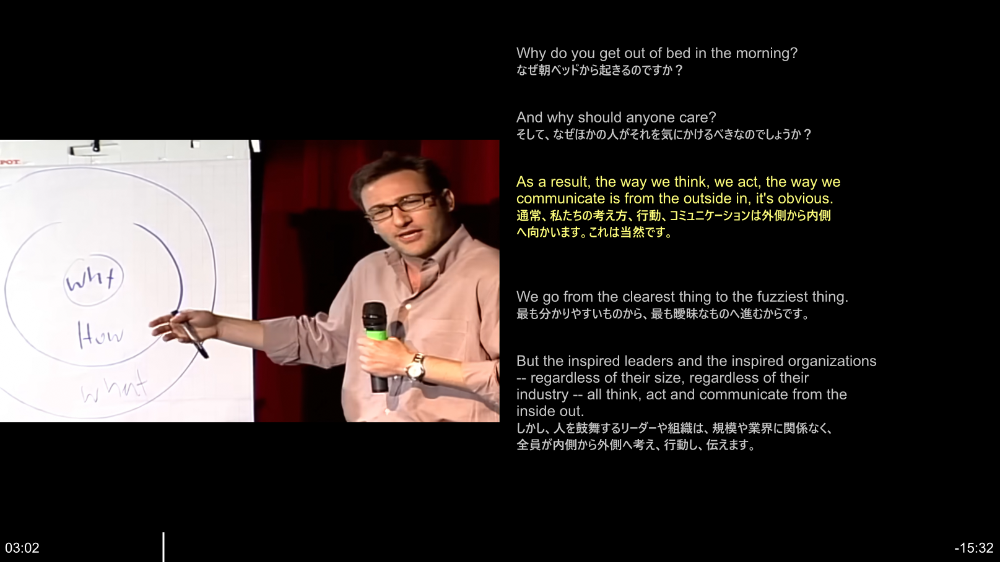
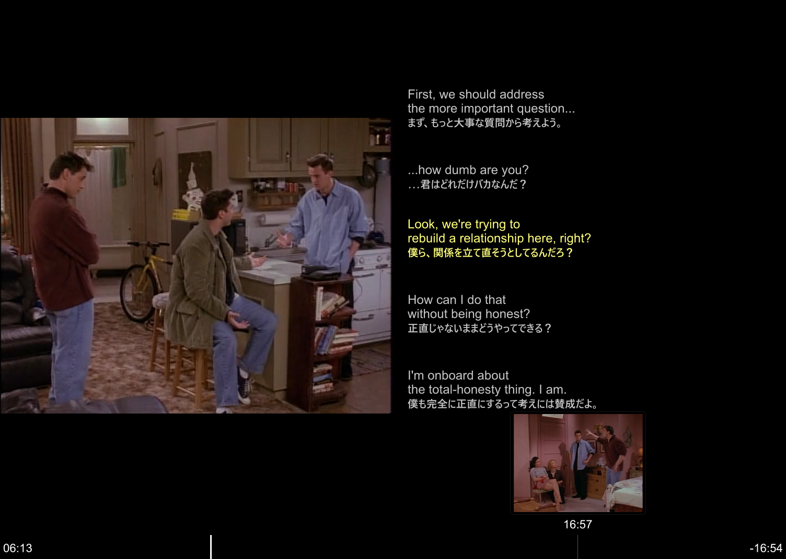

# mpv 英語学習用セット

## スクリーンショット(mpv english learning pack)

## 目的

動画再生プレイヤーmpvを英語学習のために以下のようにカスタマイズしています。

- 左 50%: 動画
- 右 50%: 字幕学習パネル
- 右パネル:
  - 前の字幕 2個
  - 現在の字幕 1個（ハイライト）
  - 次の字幕 2個
- マウス:
  - 左クリック: 再生 / 一時停止
  - 左ダブルクリック: 全画面
  - 右クリック: uosc メニュー
  - ホイール: 5秒進む / 戻る（動画部分）
- uosc + thumbfast:
  - マウス操作用コントローラー
  - シークバー
  - シークバー上のサムネイルプレビュー
- mpv終了時に再生位置を保存

---

## 一番簡単な配置方法

インストール方法などの詳細は以下を参照ください。  
[https://pc.oreda.net/software/movie-play/mpv_english_learning_pack](https://pc.oreda.net/software/movie-play/mpv_english_learning_pack)

Windows版 mpv を ZIP で展開して使っている場合、このZIPの中身を  
**mpv.exe があるディレクトリへコピーしてください。**

配置後:

mpv/  
├─ mpv.exe  
├─ install_addons.ps1  
└─ portable_config/  
   ├─ mpv.conf  
   ├─ input.conf  
   ├─ scripts/  
   │  └─ english-subs.lua  
   └─ script-opts/  
      └─ english-subs.conf

重要:  
`portable_config` 自体を mpv.exe と同じ階層に置きます。

---

## uosc / thumbfast のインストール

uosc と thumbfast は更新される外部プロジェクトなので、このZIPには固定版を入れていません。

mpv.exe のあるディレクトリで PowerShell を開き、次を実行:

powershell -ExecutionPolicy Bypass -File .\install_addons.ps1

または PowerShell から:

.\install_addons.ps1

実行後、portable_config 以下へ uosc と thumbfast が追加されます。

---

## 動画と字幕

例:

Friends.S01E01.mp4  
    Friends.S01E01 英語学習用.srt

この english-subs.lua は、動画名を先頭に含む `.srt` を探せるようにしてあります。  
そのため、MPC-BEより字幕名にメモを付けやすい構成です。

例:

Friends.S01E01.mp4  
    Friends.S01E01 英語学習用 修正版.srt

も候補になります。

同じ動画名から始まる SRT が複数ある場合は、基本的にファイル名が短いものを優先します。  
複数言語のSRTを常用する場合は、今後「英語を優先」などの条件を追加できます。

---

## 英語学習用キー

Ctrl + ←  
    前の字幕へ移動

Ctrl + →  
    次の字幕へ移動

R  
    現在の字幕の先頭からもう一度再生

S  
    右側の字幕学習パネル ON / OFF

Space  
    再生 / 一時停止

← / →  
    5秒戻る / 進む

↑ / ↓  
    10秒進む / 戻る

Shift + ← / →  
    1秒戻る / 進む

[ / ]  
    再生速度を -0.1 / +0.1

Backspace  
    再生速度を 1.0 に戻す

---

## 字幕が動画に重ならない仕組み

mpv.conf:

video-margin-ratio-right=0.50

により、右50%を動画表示から外しています。

english-subs.lua はその右側領域へ字幕を描画します。

---

## 字幕が表示されない場合

1. 字幕が `.srt` であること
2. MP4とSRTが同じディレクトリにあること
3. SRTファイル名が動画名から始まっていること

例:

OK:  
    ABC Episode 01.mp4  
    ABC Episode 01 English study.srt

NG:  
    ABC Episode 01.mp4  
    English study Episode 01.srt

---

## 注意

- SRT は UTF-8 を推奨します。
- 特殊な装飾を大量に含むSRTは、学習表示用に装飾を除去して表示します。
- 現在字幕の切り替えはSRTの開始・終了時刻を基準にします。
- 字幕間の無音区間では、次の字幕を「現在候補」として表示します。
